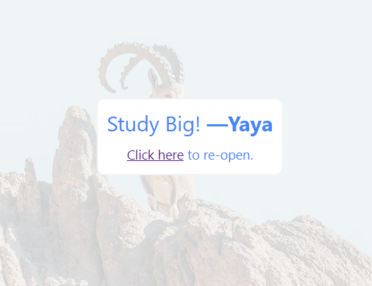

# Show and Tell Intent 

### Students starting semester one 

They will get guided to the following beauty, [right here](https://istic.computer-engineering.tech/#/Semester1/1?id=%f0%9f%93%96-communication-techniques);

### Clicking the above asset directs to this project.
- A bridge between students and materials.
- A domain with go-win to increase purpose.

### After the click, We'll amplify the act of learning.

We will propose the following message. 
And also enhance the perceived accessibility by reintegrating the link within.

### The concept is more effective for the initial semester

This not necessarily applicable to subsequent ones. 
And I'll tell you why and how my job is done here.

Once students get really in, they tend and will navigate and assimilate remaining and related information independently.